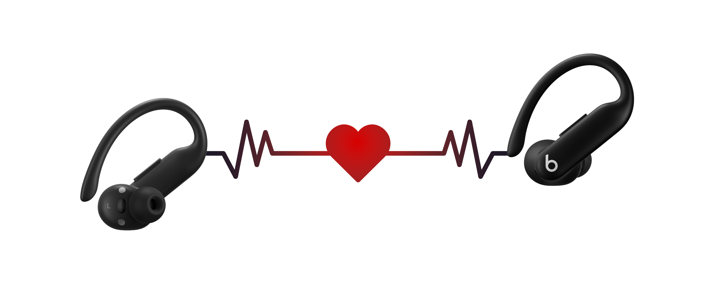

<p align="center">
  
</p>

<h1 align="center">BeatsBar</h1>

<p align="center">
  <b>Live battery and on-demand heart rate from your Powerbeats Pro 2 in the macOS menu bar.</b>
</p>

<p align="center">
  <i>Plus a deep-dive reverse-engineering log of Apple's proprietary AACP protocol — including the exact ARM64 instruction inside <code>IOBluetooth.framework</code> that blocks third-party apps from reading heart rate the way iOS does.</i>
</p>

---

## What this gives you today

- A menu bar item that always shows **live battery** (left bud · right bud · case).
- A **"Start HR session"** action that streams **live BPM** until you stop it (uses the standard BLE Heart Rate profile — see caveat below).
- A **"Launch at login"** toggle.
- The full **AACP protocol decode** for Powerbeats Pro 2 (PSM, handshake, opcodes, framing) in `research/PROTOCOL.md` — the first published map for this device specifically.
- A documented attempt at breaking macOS's kernel-side L2CAP policy, including the exact disassembly of where the rejection happens.

## Status

| | |
|---|---|
| Battery (live, while music plays) | ✅ shipping |
| Heart rate (session mode, BLE 0x180D) | ✅ shipping |
| AACP protocol decoded for Powerbeats Pro 2 | ✅ documented |
| `IOBluetooth` policy block reverse-engineered | ✅ down to the ARM64 instruction |
| Heart rate (always-on via AACP) | ❌ blocked at the macOS kernel — see [JOURNEY.md](research/JOURNEY.md) |

## What you see

Menu bar:

```
♥ 78  46%
```

Click for the breakdown:

```
🟢 Powerbeats Pro connected
Heart Rate: 78 bpm
Battery: Left 46% · Right 46% · Case 92%
Start HR session…
HR Mode ▶
Launch at login
About BeatsBar…
Quit
```

Battery streams continuously, no ceremony. The `♥ 78` only appears while a heart-rate session is running.

## How HR works (and the catch)

Powerbeats Pro 2 expose two paths for heart rate:

1. **Standard BLE Heart Rate Profile** (GATT service `0x180D`). Available only when the buds are in "fitness equipment pairing" mode — triggered by **double-tap-and-hold the b button**. While in this mode, the buds are detached from audio. BeatsBar uses this path for "Start HR session". It works, but it's not always-on, and you have to do the gesture each session.
2. **Apple AACP** over Bluetooth Classic L2CAP, PSM `0x1001`. This is the channel iOS uses to read heart rate while music plays — no mode switching, no gesture. **macOS blocks third-party apps from opening this PSM.** The block lives inside `IOBluetooth.framework` itself; even `sudo` doesn't help. We dug to the bottom of it; details below and in [`research/JOURNEY.md`](research/JOURNEY.md).

## The AACP protocol (what we documented)

| Layer | Detail |
|---|---|
| Physical | Bluetooth Classic (BR/EDR), shares the audio link |
| L2CAP PSM | `0x1001` (`kBluetoothL2CAPPSMAACP` in Apple's own SDK header) |
| SDP service name | `AAP Server` |
| Service UUID | `74ec2172-0bad-4d01-8f77-997b2be0722a` |
| Frame magic | `04 00 04 00` |
| Frame structure | `04 00 04 00 <opcode_le16> <payload>` |
| Initial handshake | `00 00 04 00 01 00 02 00 00 00 00 00 00 00 00 00` (must be the first packet) |

Once the channel is open and the handshake is sent:

```
# Subscribe to all notifications
04 00 04 00 0F 00 FF FF FE FF

# Enable HRM (control opcode 0x09, identifier 0x30, value 0x01)
04 00 04 00 09 00 30 01 00 00 00
```

Battery report comes in at opcode `0x0004` with the format `[count] ([component] 01 [level] [status] 01)*` — same as documented for AirPods Pro 2 by LibrePods. The 50 Hz raw IMU/PPG stream is opcode `0x0017`. Full opcode map: [`research/PROTOCOL.md`](research/PROTOCOL.md).

## The macOS wall

`IOBluetoothDevice.openL2CAPChannelSync(_:withPSM: 0x1001, ...)` returns IOReturn `0xe00002bc` for any third-party app. We disassembled `IOBluetooth.framework` and found the exact instruction pair that emits this:

```asm
IOBluetooth`-[IOBluetoothDevice openL2CAPChannelAsync:withPSM:withConfiguration:delegate:]
+136:  mov    w25, #0x2bc
+140:  movk   w25, #0xe000, lsl #16        ; w25 = 0xe00002bc, the default error
```

`w25` is loaded as a "default error" at the top of the function and only cleared on the success path. For PSM `0x1001`, control flow never reaches the cleared-error block — the request fails before the actual L2CAP CONN_REQ goes on the wire.

We tried:

- **Public `openL2CAPChannelSync`** → `0xe00002bc`.
- **Deprecated `openL2CAPChannel:findExisting:newChannel:`** → routes through the same internal path → same error.
- **Private `_initWithDevice:andClassicPeer:PSM:withServiceUUID:`** + `setupL2CAPChannelForDevice` → creates a real `IOBluetoothL2CAPChannel` object in user-space, but never triggers the kernel-side IOService open.
- **`IOBluetoothHCIControllerDisableL2CAPKernelDrivers(true)`** — a private function that sets a kernel property `DeviceL2CAPOnlyUserClients` via `IORegistryEntrySetCFProperty`. Returns `0xe0000007` even as `root`: requires entitlements that AMFI checks separately from unix permissions.
- **`BluetoothHCISetupUserClient`** — same entitlement gate, same rejection.
- **Listening for incoming L2CAP on PSM 0x1001** (registering as a server) → buds never initiate; they only initiate AAP to a "primary" host paired through Apple's own flow.
- **Sniffing Continuity 0x07 BLE proximity advertisements** for HR data hiding in the encrypted 16-byte tail → confirmed that's a rotating privacy MAC, not telemetry.

The realistic ways past the kernel block (none of them are user-space-only):

- **Disable SIP + AMFI** (`csrutil disable`, `nvram boot-args="amfi_get_out_of_my_way=0x1"`), then sign the helper with the right entitlement plist.
- **DriverKit / kext**, signed by Apple — needs a paid developer enrollment and Bluetooth-specific entitlement approval.
- **External USB Bluetooth dongle**, drive the radio directly via `_sendRawHCIRequest`, craft L2CAP CONN_REQ packets by hand.
- **Linux + USB BT pass-through** — LibrePods works against the same buds with the same handshake there.

The interposer dylib at [`interposer/aacp_unlock.m`](interposer/aacp_unlock.m) implements all the user-space attempts above as a documented record. It successfully creates the channel object, but doesn't get past the kernel.

## Build & run

```sh
cd src
swift build -c release
.build/release/BeatsBar &
```

The app installs into your menu bar (no Dock icon). First launch will prompt for Bluetooth permission — approve it.

Requirements:

- macOS 13+ (Apple Silicon or Intel)
- Powerbeats Pro 2 paired and connected to your Mac for audio
- Xcode command-line tools

## Architecture

```
BeatsBar/
├── src/                    # Swift menu bar app + 0x180D HR session client
├── interposer/             # DYLD_INSERT_LIBRARIES dylib (Objective-C)
├── research/               # Protocol decoding scripts + writeups + opcode map
├── assets/                 # Header image
├── docs/                   # (reserved for future docs)
└── README.md
```

Components:

- **`BeatsBar`** (Swift, `src/Sources/BeatsBar`) — `NSStatusItem`-based menu bar app. Polls `system_profiler` for battery + connection state, runs an on-demand `CBCentralManager` HR session for the 0x180D path, includes a "Kernel mode" stub backend that exercises the dylib for research.
- **`aacp_helper`** (Swift, `src/Sources/aacp_helper`) — small CLI launched by Kernel mode with the dylib injected; would emit JSON HR readings on stdout once the wire-level open succeeds.
- **`libaacp_unlock`** (Objective-C, `interposer/`) — DYLD interposer that swizzles `openL2CAPChannelSync` and tries every user-space path we found.
- **`research/`** — Python tools for parsing PacketLogger `.pklg` captures, the AACP opcode map (`PROTOCOL.md`), and the full reverse-engineering timeline (`JOURNEY.md`).

## Credits

Standing on shoulders:

- **[LibrePods](https://github.com/kavishdevar/librepods)** by [@kavishdevar](https://github.com/kavishdevar) — first comprehensive open RE of the AACP protocol on AirPods. The handshake, control opcodes, and battery format documented here come from their work.
- **[AAP-Protocol-Definition](https://github.com/tyalie/AAP-Protocol-Defintion)** by [@tyalie](https://github.com/tyalie) — first protocol notes referenced by LibrePods.
- **[Continuity Protocol](https://github.com/furiousMAC/continuity)** by furiousMAC — Apple BLE proximity advertisement format reference.

What this project contributes on top:

- First public SDP-confirmed mapping of the **AAP Server** service on **Powerbeats Pro 2** (PSM 0x1001, UUID `74ec2172-0bad-4d01-8f77-997b2be0722a`).
- First documentation of the **macOS user-space block** on PSM 0x1001 — pinned down to the exact ARM64 instructions in `IOBluetooth.framework`.
- A working menu bar app that ships the parts that *do* work (battery + session HR) without depending on the blocked path.
- An exhaustive `JOURNEY.md` of every dead end and breakthrough on the way, so the next person doesn't repeat the same loops.

## License

MIT — see `LICENSE`.
